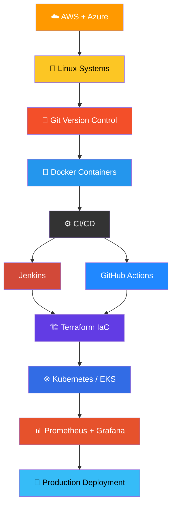

<!-- ========================= -->
<!--        HERO SECTION       -->
<!-- ========================= -->

<p align="center">
  
</p>

<p align="center">
  
</p>

<p align="center">
  <a href="https://github.com/VINAY-TEJA-GURAJAPU">
    
  </a>
  
  
</p>

---

<!-- ========================= -->
<!--        ABOUT ME           -->
<!-- ========================= -->

## 👨‍💻 About Me

```yaml
vinay:
  role: "Associate Systems Engineer @ Airtel (via Indovision)"
  focus: ["Cloud Infrastructure", "DevOps Automation", "Production Support"]
  education: "B.E. Computer Science & Engineering, 2024"
  certification: "Microsoft Azure Developer Associate (AZ-204)"
  mindset: "Always learning. Always automating."
  status: 🟢 open_to_opportunities
```

<p align="left">
  
</p>

---

<!-- ========================= -->
<!--      TECH STACK           -->
<!-- ========================= -->

## ⚡ Tech Stack

**☁️ Cloud & Infra**

<p align="center">
  
</p>

**🚀 DevOps & CI/CD**

<p align="center">
  
</p>

**💻 Systems & Development**

<p align="center">
  
</p>

**📊 Monitoring & Networking**

<p align="center">
  
  <br/>
  <code>Cisco</code> • <code>Routing</code> • <code>Switching</code> • <code>Network Operations</code> • <code>Production Infrastructure</code>
</p>

### 📊 Skill Confidence

<p align="left">
AWS&nbsp;&nbsp;&nbsp;&nbsp;&nbsp;&nbsp;&nbsp;&nbsp;<br/>
Azure&nbsp;&nbsp;&nbsp;&nbsp;&nbsp;&nbsp;<br/>
Docker&nbsp;&nbsp;&nbsp;&nbsp;&nbsp;<br/>
Kubernetes&nbsp;<br/>
Terraform&nbsp;&nbsp;<br/>
Jenkins/CI-CD<br/>
Linux&nbsp;&nbsp;&nbsp;&nbsp;&nbsp;&nbsp;<br/>
</p>

---

<!-- ========================= -->
<!--      ANIMATED JOURNEY     -->
<!-- ========================= -->

## 🌌 My Cloud & DevOps Journey



---

<!-- ========================= -->
<!--       PROJECTS            -->
<!-- ========================= -->

## 🚀 Featured Projects

<table>
<tr>
<td width="50%" valign="top">

### 🐳 DevOps E-Commerce Pipeline
**Terraform • Docker • Kubernetes (EKS)**

End-to-end infrastructure-as-code pipeline provisioning AWS resources and deploying containerized services to EKS.


</td>
<td width="50%" valign="top">

### ☸️ Kubernetes Multi-Tier App
**K8s • Docker • Microservices**

Multi-tier application deployment showcasing service orchestration, scaling, and networking on Kubernetes.


</td>
</tr>
<tr>
<td width="50%" valign="top">

### 🔥 CI/CD Pipeline
**Git → Maven → SonarQube → Jenkins → Docker → AWS**

Automated build, code-quality analysis, containerization, and deployment pipeline.


</td>
<td width="50%" valign="top">

### 📊 Monitoring Stack
**Prometheus + Grafana**

Infrastructure and application monitoring with live dashboards and alerting.


</td>
</tr>
</table>

---

<!-- ========================= -->
<!--       CERTIFICATION       -->
<!-- ========================= -->

## 🏆 Certification

<p align="center">
  
  <br/><br/>
  <strong>AZ-204 — Azure Developer Associate</strong>
</p>

---

<!-- ========================= -->
<!--       GITHUB STATS        -->
<!-- ========================= -->

## 📊 GitHub Analytics

<p align="center">
  
  
</p>

## 🔥 Contribution Streak

<p align="center">
  
</p>

<!-- ========================= -->
<!--      CONTRIBUTION SNAKE   -->
<!-- ========================= -->

## 🐍 Contribution Snake

<p align="center">
  <picture>
    <source media="(prefers-color-scheme: dark)" srcset="https://raw.githubusercontent.com/VINAY-TEJA-GURAJAPU/VINAY-TEJA-GURAJAPU/output/github-contribution-grid-snake-dark.svg">
    <source media="(prefers-color-scheme: light)" srcset="https://raw.githubusercontent.com/VINAY-TEJA-GURAJAPU/VINAY-TEJA-GURAJAPU/output/github-contribution-grid-snake.svg">
    
  </picture>
</p>

> ⚠️ This image will show broken until a GitHub Actions workflow (`platane/snk`) runs in your repo to actually generate that SVG file. Let me know if you want that workflow added.

<!-- ========================= -->
<!--      ACTIVITY GRAPH       -->
<!-- ========================= -->

## 📈 Contribution Activity

<p align="center">
  
</p>

---

<!-- ========================= -->
<!--       CURRENT FOCUS       -->
<!-- ========================= -->

## 🎯 Current Focus

<p align="center">
  
</p>

<p align="center">
  
  
  
  
  
</p>

---

<!-- ========================= -->
<!--       CONNECT             -->
<!-- ========================= -->

## 🤝 Let's Connect

<p align="center">
  <a href="https://github.com/VINAY-TEJA-GURAJAPU">
    
  </a>
</p>

<p align="center">
  
</p>

---

<p align="center">

### 🚀 BUILD • AUTOMATE • DEPLOY • SCALE


</p>
